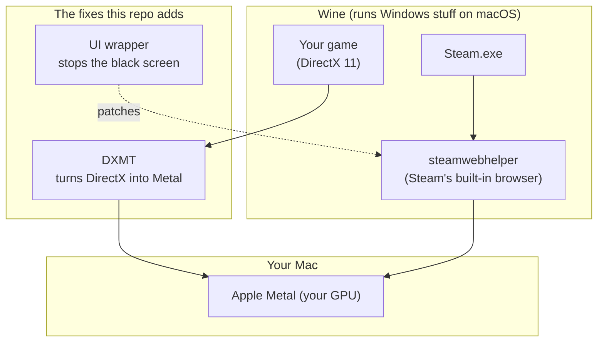

<h1 align="center">macos-wine-steam</h1>

<p align="center">
  <b>Play Windows Steam games on your Apple Silicon Mac. One command.</b><br>
  No CrossOver, no $74 license, no PhD in Wine.
</p>

<p align="center">
  
  
  
  
  
</p>

Apple Silicon only (M1/M2/M3/M4). If you have an Intel Mac, this isn't for you, sorry.

---

## What is this?

Steam has a Mac app, but Valve and game devs have mostly abandoned it. Tons of games are Windows-only. The Windows Steam client doesn't run on a Mac... unless you make it.

This repo makes it. You run one script, walk away for a bit, come back to a working Steam where you can log in, buy games, and actually play them.

The catch: getting here is a pain in the ass if you do it by hand. Two things break, and they break in confusing ways:

| You want this | Stock Wine gives you this |
|---------------|--------------------------|
| The Steam login screen | A black rectangle of nothing |
| To play a game you bought | A game that opens, thinks about it, and quits in 6 seconds |

This repo fixes both so you don't have to. That's the whole pitch.

---

## How it actually works

Three moving parts. You don't need to understand them, but here they are:



1. **Wine** runs the Windows Steam client on your Mac. We grab a prebuilt copy from [Gcenx](https://github.com/Gcenx/macOS_Wine_builds).

2. **A tiny wrapper** sits in front of Steam's internal browser and tells it to chill out on the GPU. Steam's login page is secretly a Chromium browser, and Chromium-on-Wine renders a black void by default. The wrapper is the difference between "black screen" and "I can see the login button."

3. **DXMT** translates DirectX 11 (what most Windows games speak) into Metal (what your Mac speaks). Without it, games crash on launch. On Wine 11 the off-the-shelf DXMT isn't enough, so the `--games` install compiles a patched version.

---

## Get started

### Just want the Steam client? (~5 min)

```bash
git clone https://github.com/ramiabih/play-windows-steam-on-mac.git
cd play-windows-steam-on-mac
./install.sh
```

This handles everything. Missing Homebrew? It installs it. No Xcode tools? Installs those too. Then it grabs Wine, sets up Steam, and patches the black-screen bug. You'll be able to log in, browse, and download games.

### Want to actually play games? (~45 min, once)

First, you need **full Xcode** (not just the Command Line Tools) because building the game renderer compiles Metal shaders. Grab it free from the [App Store](https://apps.apple.com/app/xcode/id497799835), open it once, then:

```bash
sudo xcode-select -s /Applications/Xcode.app/Contents/Developer
xcodebuild -downloadComponent MetalToolchain
```

Then:

```bash
./install.sh --games
```

Same as the basic install, plus it compiles the patched DXMT that makes games render. Fair warning: most of that 45 minutes is your Mac building LLVM from source (it's a compiler the game patch needs). Put on a podcast. It only happens once.

The plain Steam client doesn't need Xcode. You only need it for `--games`.

### Launch Steam

```bash
./run.sh
```

Or double-click `run.command` in Finder if terminals make you nervous.

Watch what it's doing:

```bash
tail -f "${TMPDIR:-/tmp}/macos-wine-steam.log"
```

### Quit Steam

Steam menu → Exit. Or nuke it:

```bash
pkill -f 'steam\.exe'
```

---

## What you can and can't do

**Works:**
- Logging in, your library, the store, downloads, friends list
- Installing Windows games
- Playing DirectX 11 games (after the `--games` install)
- Ultrawide and multi-monitor (the window auto-sizes to your screen)

**Annoying but doable:**
- Buying games inside the client often breaks at checkout. Wine and Steam's payment popups don't get along. Just buy in your browser:

  ```bash
  ./buy-in-browser.sh
  ```

  Log into Steam in Safari, buy there, and the game downloads in your Wine Steam like normal.

**Nope:**
- SteamVR
- Anti-cheat games (most multiplayer titles with kernel anti-cheat won't run)
- Literally every game. Some just won't cooperate. [ProtonDB](https://www.protondb.com/) gives you a rough idea of what plays nice.

---

## Install options at a glance

| Command | Time | What you get |
|---------|------|--------------|
| `./install.sh` | ~5 min | Steam client, store, downloads |
| `./install.sh --games` | ~45 min first time | Everything + playable games |
| `./install.sh` again | ~1 min | Safe to re-run anytime, skips what's done |

Reuse an existing prefix:

```bash
WINEPREFIX="$HOME/.wine-steam-11" ./install.sh --games
```

Set launch options for a specific game (Unreal Engine games like it):

```bash
WINEPREFIX="$HOME/.wine-steam-11" ./scripts/set-launch-options.sh <APPID> "-d3d11 -windowed"
```

Restart Steam after changing those.

---

## What you need

Basically nothing. The installer sorts out the rest.

- An Apple Silicon Mac (M1 or newer)
- About 10 GB free (more once you start downloading games)
- An internet connection
- Patience for the `--games` build

You do **not** need to pre-install Homebrew or Wine. The script grabs those. The one thing it can't auto-install is **full Xcode**, and you only need that for `--games` (compiling the game renderer). The basic Steam client needs nothing but the script.

---

## Where it puts stuff

| Path | What's there |
|------|--------------|
| `~/wine-11.8/` | The Wine runtime |
| `~/.wine-steam/` | Your fake Windows C: drive + Steam |
| `~/DXMT/` | The DirectX-to-Metal bits |
| `~/dev/dxmt/` | DXMT source + LLVM (only if you ran `--games`) |
| `$TMPDIR/macos-wine-steam.log` | The launch log |

---

## When things go wrong

**Steam window is black.**
The wrapper didn't take. Re-run and relaunch:

```bash
./install.sh && ./run.sh
```

**Game opens then closes after a few seconds.**
You installed without `--games`, so the game can't render. Fix it:

```bash
./install.sh --games
```

Watch it cook: `tail -f /tmp/dxmt-fork-build.log`. Wait for `DXMT fork installed`.

**Checkout page is blank or throws errors.**
Buy in your browser with `./buy-in-browser.sh`. Also try Steam → Settings → Family and turn off Family View if it's on.

**SSL or certificate complaints.**
Re-run `./install.sh`. It copies your Mac's certificates into the prefix.

**Want it gone.**

```bash
./uninstall.sh
```

That clears the prefix and launchers. The Wine and DXMT downloads in `~/wine-*` and `~/DXMT` stick around. Delete them by hand if you want the space back.

---

## Knobs you can turn

| Variable | Default | What it does |
|----------|---------|--------------|
| `WINE_VERSION` | `11.8` | Which Gcenx Wine to use |
| `WINE_ROOT` | `~/wine-$WINE_VERSION` | Where Wine lives |
| `WINEPREFIX` | `~/.wine-steam` | Your virtual Windows drive |
| `DXMT_VERSION` | `0.80` | DXMT release for the UI fallback |
| `DXMT_ROOT` | `~/DXMT` | Where DXMT files go |
| `WINE_VIRTUAL_DESKTOP` | `auto` | Force a size like `3440x1440`, or empty to disable |
| `STEAM_LOG` | `$TMPDIR/macos-wine-steam.log` | Launch log location |
| `DXMT_LOG_LEVEL` | `error` | Set to `debug` if a game won't render and you want logs |

---

## What's in the box

```
macos-wine-steam/
├── install.sh              # the one command (add --games for game support)
├── run.sh / run.command    # launch Steam
├── buy-in-browser.sh       # buy games in Safari when checkout breaks
├── uninstall.sh
├── lib/common.sh           # shared settings
├── scripts/
│   ├── install-prereqs.sh  # Homebrew + Xcode tools if you're missing them
│   ├── install-wine.sh
│   ├── install-steam.sh
│   ├── install-dxmt.sh
│   ├── install-wrapper.sh  # the black-screen fix
│   ├── build-dxmt-fork.sh  # the game-rendering fix (slow, one-time)
│   └── configure-game-launch.sh
└── wrapper/
    └── src/steamwebhelper-wrapper.c
```

---

## Why does `--games` take forever?

It's compiling, not downloading. The game fix relies on a [patched DXMT](https://github.com/notpop/dxmt), and that needs LLVM 15 built from scratch (it's the shader compiler). No prebuilt exists for this combo yet, so your Mac builds it. ~30-40 minutes, once.

Down the road we want to ship prebuilt binaries so nobody has to sit through this. For now, the compile is the reliable path.

---

## Contributing

This works on the machines we've tested, which is a small number of machines. If it breaks on yours, that's useful to know.

- **Found a bug?** Open an issue. Paste the relevant log (`$TMPDIR/macos-wine-steam.log` or `/tmp/dxmt-fork-build.log`) and your Mac model + macOS version.
- **Got a game working that needed special launch options?** Tell us in an issue so we can document it.
- **Fixed something?** PRs welcome. Keep scripts POSIX-ish bash, idempotent, and quiet unless something's wrong.

No CLA, no bureaucracy. It's a bunch of shell scripts that wrestle Wine into submission.

If this saved you the price of CrossOver, a ⭐ is a nice way to say thanks.

## Standing on shoulders

None of the hard parts are mine. Credit where it's due:

- [Gcenx/macOS_Wine_builds](https://github.com/Gcenx/macOS_Wine_builds) for Wine on macOS
- [3Shain/dxmt](https://github.com/3Shain/dxmt) for DirectX-to-Metal
- [notpop/dxmt](https://github.com/notpop/dxmt) for the Wine 11 patches
- [notpop/steam-on-m1-wine](https://github.com/notpop/steam-on-m1-wine) for the wrapper trick

## License

MIT. See [LICENSE](LICENSE). Do whatever you want with it.
